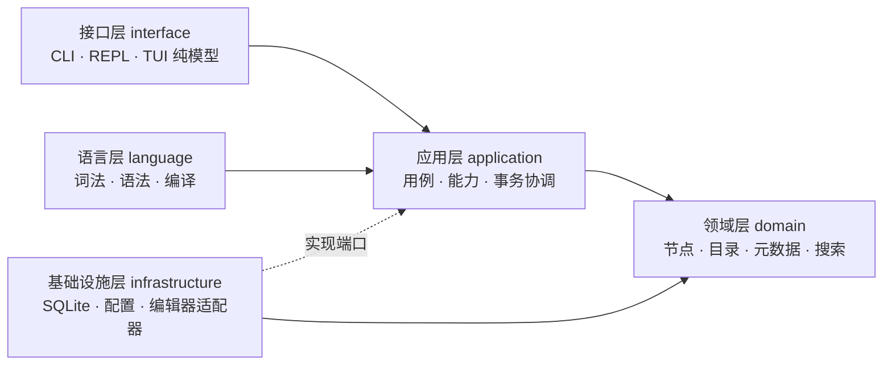

# Promptr

[产品展示页](https://promptr.moesegfault.dev) · [系统设计](docs/sys.md) ·
[DSL 规范](docs/dsl.md)

Promptr 是一个本地优先（local-first）的持久化提示词图管理器。它把可复用正文保存为
**Fragment**，把有序组合保存为 **Prompt**，并通过一门小型领域特定语言
（domain-specific language, DSL）对同一张有向无环图（directed acyclic graph, DAG）
进行查询、修改与确定性 XML 渲染。

> 当前版本为 `0.1.0`，接口仍在演进。规范分别见[系统设计](docs/sys.md)、
> [DSL 设计](docs/dsl.md)和[运行时决策记录](docs/adr/0001-runtime-semantics.md)。

## 功能

- Fragment 正文与 Prompt 有序引用持久化到 SQLite；
- 创建或替换组合、重命名、受引用保护的删除；
- `description` 与完整标签集的强类型元数据（metadata）；
- 全局搜索，以及限定在 Prompt 可达子图内的搜索；
- 确定性的规范 XML 输出；
- 终端用户界面（terminal user interface, TUI）、交互式 REPL、脚本执行、单次求值和只检查模式；
- 人类可读、版本化 JSON 与纯 XML 三种输出契约；
- 配置检查、配置迁移、数据库状态、备份、一致性检查及索引重建。

## 架构

所有宿主共用解析、编译、事务和解释语义。依赖方向指向内层；领域层不依赖 SQLite、
终端或命令行框架。



执行管线如下：

```text
源码 -> 解析 -> 基于快照预编译 -> 锁外准备交互正文
     -> BEGIN IMMEDIATE -> 事务快照内重新编译 -> 解释 -> COMMIT -> 发布结果
```

这种结构避免用户编辑期间占用写锁，并在真正写入前再次检查名称、引用、环和乐观修订号
（optimistic revision）。

## 安装

要求 Rust `1.88` 或更高版本（项目使用 Rust 2024 edition）。

```bash
git clone https://github.com/kleedaisuki/promptr.git
cd promptr
cargo install --path .
```

开发时也可以直接运行：

```bash
cargo run -- --help
cargo build --release
```

## 快速开始

### 交互创建 Fragment

无子命令且标准输入/输出均连接终端时启动 TUI；按 `?` 可查看帮助，`:` 执行 DSL，`/`
搜索，`e` 编辑选中的 Fragment，`m` 编辑描述，`Ctrl+S` 保存编辑，`Esc` 取消，`q` 退出。

非终端标准流会回退到逐语句 REPL。其 `FRAGMENT` 多行编辑以 `.save` 明确保存，
`.cancel` 或输入结束则取消；已有 Fragment 的原文会先显示，随后输入的是完整替换正文。
下面展示该 REPL 协议（也适用于嵌入时提供的输入流）：

```text
promptr> FRAGMENT Notice;
-- fragment editor (.save saves, .cancel cancels); current text follows --
Preserve userspace compatibility.
.save
promptr> FRAGMENT Comment;
-- fragment editor (.save saves, .cancel cancels); current text follows --
Prefer simple designs.
.save
promptr> Coding: [Notice, Comment];
promptr> METADATA Coding DESCRIPTION "Reusable coding prompt";
promptr> METADATA Coding TAGS ["coding", "systems"];
promptr> OUTPUT Coding;
<Coding><Notice>Preserve userspace compatibility.
</Notice><Comment>Prefer simple designs.
</Comment></Coding>
promptr> :quit
```

REPL 首列以 `!` 开头时执行平台 shell 元命令；它不是 DSL，不能用于 TUI 命令、`run`、
`eval` 或 Rust API。

### 单次求值与脚本

```bash
# 对现有目录求值
promptr eval 'LIST FRAGMENTS;'
promptr eval 'SEARCH "compatibility" FROM CONTENT;'

# 整个文件作为一个程序执行；“-”表示从标准输入读取
promptr run examples.ptr
promptr run - < examples.ptr

# 只做语法和语义检查，不执行
promptr check examples.ptr
```

一个可在 Fragment 已存在后运行的脚本示例：

```promptr
Coding: [Notice, Comment];
METADATA Coding DESCRIPTION "Reusable coding prompt";
METADATA Coding TAGS ["coding", "systems"];
PRINT Coding;
OUTPUT Coding;
```

`run`、`eval` 和 `check` 是非交互模式，不会为 `FRAGMENT` 打开编辑器；需要交互正文
提供者的 Fragment 创建/编辑应在当前 REPL 中完成。

### 机器输出：JSON 与 raw

JSON 模式在标准输出（stdout）仅产生一个带版本号的文档，适合其他程序消费：

```bash
promptr --format json eval 'LIST;'
# {"schema_version":1,"ok":true,"values":[...]}
```

纯输出模式 `raw` 只接受结果全部为 `OUTPUT` XML 的 `run` 或 `eval` 调用；标准输出仅含
规范 XML，不混入提示、日志或诊断：

```bash
promptr --format raw eval 'OUTPUT Coding;' > coding.xml
```

失败时 JSON 仍写一个 `ok: false` 的版本化文档；human/raw 模式的诊断写入标准错误
（stderr）。退出码 `2` 表示语法、能力或配置问题，`3` 表示兼容性问题，其他运行失败
返回 `1`。

## DSL 速查

```promptr
FRAGMENT Notice;
Coding: [Notice, Comment];
RENAME Comment TO Documentation;
METADATA Coding DESCRIPTION "说明";
METADATA Coding TAGS ["coding", "systems"];
LIST;
LIST FRAGMENTS;
PRINT Coding;
OUTPUT Coding;
SEARCH "compatibility" FROM MIXED;
FIND "compatibility" ON Coding FROM CONTENT;
DELETE Documentation;
```

符号区分大小写。Prompt 子项有序且可重复，图必须无环；删除仍被 Prompt 引用的节点会
失败。完整语法、字符串转义和 XML 字节规则以 [DSL 规范](docs/dsl.md)为准。

## 配置与数据路径

首次启动无需配置文件。Promptr 通过平台原生应用目录解析配置、数据、状态与缓存根目录，
Linux 遵循 XDG Base Directory，macOS 与 Windows 使用各自原生目录。不要猜测具体路径，
可用以下命令获得当前机器上的权威结果：

```bash
promptr config path
promptr config show --effective
promptr db status
promptr doctor
```

| 数据 | 默认位置 |
| --- | --- |
| 用户配置 | 平台配置目录中的 `config.toml` |
| SQLite 目录 | 平台数据目录中的 `promptr.db` |
| 状态 | 平台状态目录；不支持时回退到本地数据目录的 `state` |
| 备份 | 状态目录下的 `backups` |
| 缓存 | 平台缓存目录 |

配置优先级为：内置默认值 < 用户配置 < `--config`/`PROMPTR_CONFIG` 指定的叠加配置
< 环境变量 < CLI 参数。`--no-config` 禁用所有文件配置，`--database` 或
`PROMPTR_DATABASE` 可覆盖数据库路径。可识别的其他环境覆盖包括 `PROMPTR_COLOR`、
`PROMPTR_GLYPHS`、`PROMPTR_EDITOR_MODE` 和 `PROMPTR_SEARCH_FIELD`。

交互界面还可用 `--color`、`--glyphs`、`--theme`、`--preview` 和 `--mouse` 做单次调用覆盖；
显式颜色选项优先于 `NO_COLOR`，而 `TERM=dumb` 始终降级为单色 ASCII 输出。

```bash
promptr config init
promptr config check
promptr config migrate --check
promptr config explain database.path
```

普通启动只读取 TOML，不改写手工格式和注释；显式迁移才更新配置，并先创建备份。

## 事务与兼容行为

- 每次 REPL 语句、一次 `eval` 或整个 `run` 脚本各自构成一个原子事务；失败会整体回滚。
- Fragment 的交互编辑在写事务外完成；保存时在 `BEGIN IMMEDIATE` 事务内重新编译并检查
  修订冲突，不静默覆盖并发更新。
- 查询结果先在事务内缓冲，提交成功后才发布，避免输出已回滚状态。
- 同一次调用的规范 XML 共享 16 MiB 内存预算，超过预算后以 64 KiB 缓冲流式落盘；
  提交失败时暂存输出随值生命周期自动清理。
- 当前 SQLite 连接固定使用本地文件系统上的 WAL、`synchronous=FULL` 和有界忙等待；
  不支持把默认 WAL 数据库放到网络文件系统。
- 配置和数据库都带模式版本。较旧程序不会猜测较新模式的含义；可先用
  `config check`、`db status` 和 `doctor` 检查。配置可显式迁移；当前数据库仅有初始
  schema v1，没有可执行的历史升级链，不兼容时应选用匹配版本或升级程序。
- 数据库迁移账本只追加（append-only）；已发布迁移不会被就地重写。

## 当前范围

当前命令入口提供 TUI、非终端流 REPL、`run`、`eval`、`check`、配置及数据库维护命令。
TUI 已接入内置多行编辑器、显式配置的外部编辑器、四类预览、剪贴板、自定义主题、
终端能力适配及跨进程数据库变更检测。`search.field` 决定省略 `FROM` 时的字段，
`search.matcher` 支持 `fuzzy` 与大小写敏感的 `exact` 子串匹配。v0.1 明确不包含网络同步、
多人协作、插件系统、模板变量、控制流、任意键值元数据、强制/级联删除或在 DSL 脚本中
执行 shell。

## 参与开发

请阅读 [CONTRIBUTING.md](CONTRIBUTING.md)。问题与补丁应尽量带上最小复现、期望行为和
验证命令。

## 许可证

本项目以 [GNU GPL v3.0 only](LICENSE) 发布。
