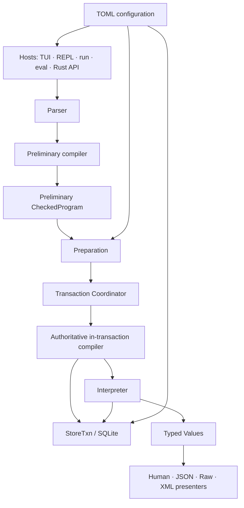

# Promptr System Design

Status: Draft  
Companion specification: `dsl.md`

The reconciled v0.1 runtime decisions are recorded in
[`adr/0001-runtime-semantics.md`](adr/0001-runtime-semantics.md).

## 1. Purpose

Promptr is a small language runtime for a persistent named prompt DAG. The TUI,
REPL, script runner, one-shot CLI, and Rust API are hosts of the same execution
core; none of them owns separate mutation semantics.

This document specifies the system around the language: execution modes,
compiler and interpreter boundaries, transactions, persistence, configuration,
migrations, metadata, and TUI interaction. `dsl.md` remains authoritative for
surface syntax and canonical XML bytes.

The architectural identity is:

```text
Promptr = Persistent Named DAG
        + Tiny DSL
        + Shared Execution Runtime
        + Deterministic XML Renderer
        + Searchable TUI
```

This document uses **MUST**, **MUST NOT**, **SHOULD**, and **MAY** as normative
terms.

## 2. Design principles

1. **One semantic path.** Every frontend produces the same typed commands and
   consumes the same typed values and diagnostics.
2. **Convention before configuration.** A first launch MUST work without a
   configuration file. Configuration overrides defaults; it does not complete
   an otherwise unusable installation.
3. **Durable by default.** Successful mutations commit immediately. There is no
   second, unsaved catalog state.
4. **External effects are explicit.** Store reads, store writes, file reads,
   standard input, interactive editing, and shell execution are distinct
   capabilities.
5. **Human and machine output are separate contracts.** Human presentation is
   not a machine interface; canonical XML, JSON schemas, exit codes, and
   diagnostic codes are machine interfaces.
6. **Color is decoration, not information.** Every state conveyed by color MUST
   also have text, a glyph, position, or shape.
7. **Mouse is an alternate input device, not a second UI.** Every mouse action
   MUST map to the same `UiAction` as a keyboard action and MUST have a keyboard
   equivalent.
8. **Readable files stay readable.** Hand-authored TOML is not silently
   reformatted, stripped of comments, or rewritten on ordinary startup.
9. **Forward compatibility is explicit.** An older executable MUST refuse to
   interpret a newer database or configuration schema rather than guess its
   meaning. This is a compatibility invariant, paired with observable version
   diagnostics and explicit upgrade/inspection commands—not a generalized
   security or fail-closed policy.
10. **Local-first, synchronous core.** Promptr uses a synchronous event and
    execution model. The domain core has no asynchronous runtime dependency.

## 3. System context



The high-level pipeline is:

```text
source
  -> parse
  -> semantic analysis against a catalog overlay
  -> capability validation
  -> prepare external inputs without a write lock
  -> BEGIN IMMEDIATE
  -> recompile and revalidate against the transaction snapshot
  -> check optimistic revisions inside the transaction
  -> interpret
  -> commit
  -> publish buffered outputs
```

Read-only programs omit preparation and use a read transaction only when a
stable multi-query snapshot is required.

## 4. Invocation modes

### 4.1 Commands

Promptr exposes:

```bash
promptr                       # interactive TUI/REPL
promptr run program.ptr       # script file
promptr run -                 # script from stdin
promptr eval 'OUTPUT Root;'   # one-shot source
promptr check program.ptr     # parse and compile only
```

The Rust library exposes the same capabilities without spawning a process:

```rust
let app = Promptr::open(options)?;
let values = app.eval("OUTPUT Coding;", policy)?;
```

Other languages and agents use the CLI with `--format json`.

### 4.2 Policy matrix

| Mode | Source unit | Mutation boundary | Interactive input | Default presenter |
| --- | --- | --- | --- | --- |
| TUI/REPL | one submitted statement | one statement | allowed | human |
| `run` | complete script | whole script | denied | human or JSON |
| `eval` | complete invocation | whole invocation | denied | raw for `OUTPUT`, otherwise human |
| `check` | complete source | none | denied | diagnostics |
| Rust API | caller-selected program | whole call | policy-controlled | typed values |

`run`, `eval`, and JSON mode MUST never open an editor, prompt for
confirmation, enable a pager, or wait for unspecified terminal input.

### 4.3 Machine-mode contract

When `--format json` is active:

- standard output contains exactly one versioned JSON result document;
- standard error contains only diagnostics that cannot be represented in that
  result, such as process-startup failures;
- ANSI styling, paging, editor launch, and confirmations are disabled;
- field names, error codes, and exit codes are compatibility surfaces;
- locale MUST NOT change numeric, timestamp, or enum serialization.

For raw `OUTPUT`, standard output contains only canonical XML. Logs, progress,
warnings, and diagnostics go to standard error.

## 5. Compiler, interpreter, and effects

### 5.1 Compiler boundary

The compiler transforms `AST` into `CheckedProgram<Vec<Op>>`. Before
preparation this result is a preliminary plan used to validate capabilities and
identify required external input. After `BEGIN IMMEDIATE`, the same AST plus
prepared inputs MUST be compiled again against the transaction snapshot; that
second result is authoritative for execution. Compilation performs:

- name resolution;
- node-kind checking;
- symbol and XML-text validation;
- reference validation;
- empty-prompt rejection;
- cycle detection;
- deletion preconditions;
- invocation capability checks;
- construction of a catalog overlay for earlier statements in the same script;
- generation of optimistic revision preconditions for prepared edits.

The compiler receives only `&dyn StoreView` and MUST NOT mutate persistent
state. A script can therefore refer to objects created by earlier statements
without partially executing the script.

### 5.2 Intermediate representation

The IR is domain-shaped rather than bytecode-shaped:

```rust
enum Op {
    UpsertFragment { target: NodeRef, input: PreparedText },
    ReplacePrompt { target: NodeRef, children: Vec<NodeRef> },
    Rename { target: NodeRef, new_symbol: Symbol },
    Delete { target: NodeRef },
    SetMetadata { target: NodeRef, patch: MetadataPatch },
    List { filter: NodeFilter },
    Inspect { target: NodeRef },
    Search { query: SearchQuery },
    RenderXml { root: NodeRef },
}
```

The system contains no bytecode VM, user variables, loops, or functions.

### 5.3 Effects and capabilities

Every operation declares an effect set:

```rust
bitflags! {
    struct Effects: u8 {
        const READ_STORE  = 1 << 0;
        const WRITE_STORE = 1 << 1;
        const READ_FILE   = 1 << 2;
        const READ_STDIN  = 1 << 3;
        const INTERACTIVE = 1 << 4;
    }
}
```

Invocation policy checks effects before execution. `check` permits catalog
reads only. Script and eval modes deny `INTERACTIVE`. The TUI permits all core
effects.

The `!` shell form is a REPL meta-action, not a domain operation. It is
intentionally outside `CheckedProgram`, store transactions, script execution,
and the Rust domain API. The shell itself is the correct script host for
external commands.

### 5.4 Interpreter boundary

The interpreter accepts only a checked program and an appropriate `StoreTxn` or
`StoreView`. It MUST NOT parse source, launch editors, print to a terminal, or
construct frontend widgets.

It returns typed values:

```rust
enum Value {
    Unit,
    Text(String),
    Xml(String),
    Node(NodeView),
    Nodes(Vec<NodeView>),
    SearchResults(Vec<SearchHit>),
    Metadata(NodeMetadataView),
}
```

## 6. Preparation and transaction semantics

### 6.1 Preparation phase

Interactive editing and file/stdin reads happen before a SQLite write
transaction. No user think-time may hold a writer lock.

An edit preparation captures:

```text
PreparedEdit {
    node_id,
    base_revision,
    original_text,
    edited_text
}
```

After preparation, the coordinator acquires the writer reservation with `BEGIN
IMMEDIATE`. It then recompiles and revalidates the source against the
transaction snapshot and checks `base_revision` before applying any operation.
The write reservation remains held through interpretation and commit, so no
other writer can invalidate those checks. If another process changed the node
before the reservation was acquired, the save fails with `E_CONFLICT`; the UI
offers:

- reopen the latest value;
- view a two-way diff;
- save the draft to a user-selected file;
- cancel.

Promptr MUST NOT silently overwrite the newer value and does not perform an
automatic merge.

### 6.2 Transaction coordinator

SQLite owns ACID behavior. `TxnCoordinator` owns only transaction boundaries,
output buffering, retry policy, and commit/rollback sequencing.

```text
REPL/TUI statement  -> one transaction
eval invocation     -> one transaction
script              -> one transaction
```

Read-only statements use read transactions only when a stable multi-query
snapshot is required. Write programs begin with `BEGIN IMMEDIATE` after all
external input is prepared, so lock failure occurs before mutations begin.
All name resolution, kind/reference/cycle validation, deletion preconditions,
and optimistic node/catalog revision checks are then repeated inside that write
transaction before the first mutation. Performing a revision check before
`BEGIN IMMEDIATE` is only advisory and MUST NOT authorize a write, because that
would leave a time-of-check/time-of-use (TOCTOU) window.

### 6.3 Transactional output

Script and eval results are buffered until commit:

```text
interpret -> OutputBuffer -> COMMIT -> flush stdout
                         \-> ROLLBACK -> discard
```

This prevents callers from observing XML generated from a state that was later
rolled back. Buffers up to 16 MiB remain in memory; larger buffers spool to a
secure temporary file and are published only after commit.

### 6.4 Busy and retry policy

Promptr sets a bounded SQLite busy timeout. It MUST NOT retry a whole mutating
program after an ambiguous commit result. Safe retries are limited to acquiring
the initial write lock before any operation has run. TUI lock failures produce
a non-blocking error with a retry action; machine modes return a stable nonzero
exit code.

## 7. Persistent data model

### 7.1 Logical schema

```sql
CREATE TABLE nodes (
    id              INTEGER PRIMARY KEY,
    symbol          TEXT NOT NULL UNIQUE COLLATE BINARY,
    kind            INTEGER NOT NULL CHECK (kind IN (1, 2)),
    description     TEXT,
    created_at_ms   INTEGER NOT NULL,
    updated_at_ms   INTEGER NOT NULL,
    revision        INTEGER NOT NULL CHECK (revision > 0)
);

CREATE TABLE fragments (
    node_id          INTEGER PRIMARY KEY
                     REFERENCES nodes(id) ON DELETE CASCADE,
    content          TEXT NOT NULL
);

CREATE TABLE prompt_edges (
    parent_id        INTEGER NOT NULL
                     REFERENCES nodes(id) ON DELETE CASCADE,
    ordinal          INTEGER NOT NULL CHECK (ordinal >= 0),
    child_id         INTEGER NOT NULL
                     REFERENCES nodes(id) ON DELETE RESTRICT,
    PRIMARY KEY (parent_id, ordinal)
);

CREATE INDEX prompt_edges_child_idx ON prompt_edges(child_id);

CREATE TABLE tags (
    id               INTEGER PRIMARY KEY,
    name             TEXT NOT NULL UNIQUE COLLATE BINARY
);

CREATE TABLE node_tags (
    node_id          INTEGER NOT NULL
                     REFERENCES nodes(id) ON DELETE CASCADE,
    tag_id           INTEGER NOT NULL
                     REFERENCES tags(id) ON DELETE CASCADE,
    PRIMARY KEY (node_id, tag_id)
);

CREATE TABLE app_state (
    singleton        INTEGER PRIMARY KEY CHECK (singleton = 1),
    catalog_revision INTEGER NOT NULL
);

CREATE TABLE schema_migrations (
    version          INTEGER PRIMARY KEY,
    name             TEXT NOT NULL,
    checksum         TEXT NOT NULL,
    applied_at_ms    INTEGER NOT NULL,
    app_version      TEXT NOT NULL
);
```

The schema shown here is normative at the logical level; migrations own the
exact SQL.

### 7.2 Metadata model

Metadata is divided by ownership, preventing one generic key-value bag from
becoming an untyped second database.

| Class | Fields | Owner | Persistence |
| --- | --- | --- | --- |
| Identity | `NodeId`, `Symbol`, `kind` | domain | SQLite |
| User metadata | `description`, `tags` | user | SQLite |
| Operational | created/updated time, node revision | runtime | SQLite |
| Derived | byte size, direct references, reachable occurrences, rendered size | query layer | recomputed |
| UI session | focus, selection, expanded rows, scroll offsets, draft cursor | TUI | memory only |

Rules:

- `description` is optional UTF-8 plain text and is not part of canonical XML.
- Tags are an unordered set. Their spelling is preserved and identity is
  bytewise case-sensitive; fuzzy search is case-insensitive.
- Empty or whitespace-only tag names are invalid.
- Timestamps are UTC Unix milliseconds. They are presentation-neutral.
- Any domain mutation increments the target node revision and the global
  catalog revision in the same transaction.
- Renaming preserves `NodeId`, creation time, tags, description, and references.
- User metadata consists exactly of `description` and `tags`. There is no
  arbitrary key-value or JSON metadata bag.

Metadata changes are typed domain commands. The TUI MUST NOT issue SQL directly.
TUI forms, DSL statements, CLI subcommands, and the Rust API all compile to the
same internal `Command::SetMetadata` operation. Description and tag assignment
replace the complete prior value; an empty string clears a description and an
empty list clears tags.

### 7.3 Search indexes

Symbol fuzzy matching runs in memory. Fragment content search uses SQLite FTS5
as its candidate generator. FTS tables are derived state: migrations and repair
tools rebuild them from canonical tables.

### 7.4 Connection policy

Every connection enables and verifies:

```text
foreign_keys = ON
journal_mode = WAL          # local filesystem default
synchronous = FULL          # honors immediate durability across power loss
busy_timeout = bounded
trusted_schema = OFF
```

The database belongs on a local filesystem. WAL is not supported on a network
filesystem. `database.journal_mode = "delete"` selects rollback-journal mode
for a database that cannot use WAL.

The TUI compares `PRAGMA data_version` on focus regain and during an idle poll;
if another connection committed, it invalidates catalog projections while
preserving the user's current symbol-based selection when possible. SQLite
documents `data_version` specifically for detecting changes by other
connections: [SQLite PRAGMA documentation](https://www.sqlite.org/pragma.html#pragma_data_version).

## 8. Configuration system

### 8.1 Configuration is optional

The default installation chooses:

- the platform data directory for SQLite;
- the built-in editor;
- automatic color and glyph capability detection;
- mouse support when the terminal reports it;
- mixed fuzzy search;
- safe database migration with backups;
- a responsive two-pane layout.

No generated config file is required. `promptr config init` creates a commented
example containing only commonly changed settings, not a dump of every default.

### 8.2 Precedence

Configuration is resolved as an ordered overlay:

```text
built-in defaults
  < platform user config
  < explicitly selected config (--config or PROMPTR_CONFIG)
  < environment overrides
  < CLI flags
```

Later sources override earlier sources field by field. An explicit config file
extends the user config rather than silently disabling it; `--no-config`
disables all file-based configuration. Promptr does not discover configuration
by walking parent workspace directories, because merely entering an untrusted
directory must not change editor commands or database paths.

Linux paths follow the XDG Base Directory specification; macOS and Windows use
their native application directories through one platform abstraction. Config,
data, state, cache, and backup locations MUST remain distinct. See the
[XDG Base Directory Specification](https://specifications.freedesktop.org/basedir-spec/latest/).

### 8.3 Typed configuration

Example:

```toml
schema_version = 1

[ui]
color = "auto"          # auto | truecolor | ansi256 | ansi16 | none
glyphs = "auto"         # auto | unicode | ascii
theme = "dark"          # dark | light | monochrome | custom theme name
mouse = true
preview = "tree"        # tree | xml | content | metadata

[editor]
mode = "builtin"        # builtin | external
external = ["nvim", "{file}"]

[database]
busy_timeout_ms = 2000
auto_migrate = true
backup_before_migrate = true
backup_keep = 3

[search]
field = "mixed"
matcher = "fuzzy"

[themes.moe]
surface = "#171421"
text = "#eeeaf7"
muted = "#8f879e"
selection = "#5b3f87"
fragment = "#7dd3fc"
prompt = "#c4b5fd"
tag = "#f9a8d4"
success = "#86efac"
warning = "#fde68a"
error = "#fda4af"
```

The database path is normally omitted. It is overridden with
`--database`, `PROMPTR_DATABASE`, or a typed `database.path` setting.

Parsing has two stages:

```text
TOML lossless document -> versioned raw config -> validated Config
```

The lossless document representation preserves comments, ordering, and
formatting during explicit migrations. Runtime code receives a fully typed,
validated `Config`; it never reads arbitrary TOML values. TOML 1.0 is the file
format contract: [TOML v1.0 specification](https://toml.io/en/v1.0.0).

### 8.4 Validation and observability

Unknown keys are errors with edit-distance suggestions. Deprecated keys are
accepted only while a documented migration exists and produce a warning.
Invalid enum values, impossible numeric ranges, conflicting editor settings,
and inaccessible paths fail before terminal raw mode or database mutation.
Custom themes must define every required semantic color token. Colors accept
named ANSI colors or `#RRGGBB`; the capability adapter deterministically maps
them to the active terminal palette.

Configuration diagnostics include source provenance:

```text
ui.color = "ansi256"
  from: /home/klee/.config/promptr/config.toml:4
  overridden by: --color=none
```

The management surface is:

```bash
promptr config path
promptr config init
promptr config check [PATH]
promptr config show --effective
promptr config explain ui.color
promptr config migrate [--check]
```

`show --effective` renders the complete effective configuration and the source
of every value. Promptr configuration contains no secret-valued settings.

### 8.5 Configuration migration

Config schema versions are monotonically increasing integers.

On ordinary startup:

1. parse the TOML losslessly;
2. stop normal loading for a schema newer than the executable and report the
   found and maximum supported versions plus an upgrade/inspection path;
3. migrate older schemas in memory;
4. validate the resulting typed config;
5. warn that an explicit migration is available;
6. do **not** rewrite the file.

A newer configuration produces stable `E_CONFIG_SCHEMA_NEW` diagnostics with
the config path, found schema version, maximum supported version, and
application version. The diagnostic directs the operator to upgrade Promptr;
`promptr config check PATH` and `promptr doctor` can report the version and
source without constructing the normal typed runtime configuration.

`promptr config migrate` performs a durable rewrite:

1. acquire an advisory per-config lock;
2. parse and validate the original;
3. apply ordered AST-to-AST transforms;
4. preserve comments and unrelated formatting where possible;
5. write a sibling temporary file with restrictive permissions;
6. flush the file, atomically replace the destination, and flush the parent
   directory where the platform supports it;
7. retain one timestamped backup of the original.

Migration functions MUST be idempotent and covered by golden-file tests. A
failure leaves the original bytes untouched. Config migration is forward-only;
restoring the timestamped backup restores the earlier bytes.

## 9. Database lifecycle and migrations

### 9.1 Open sequence

Startup order is deliberately boring:

```text
parse early CLI flags
  -> locate and validate config
  -> resolve database path
  -> open and identify database
  -> inspect schema version
  -> backup and migrate if required
  -> verify invariants
  -> construct App
  -> enter terminal raw mode last
```

Migration and configuration errors therefore render as ordinary terminal text.

### 9.2 Identity and versioning

New databases receive a unique SQLite `application_id`. Existing files with a
different nonzero application ID are rejected. SQLite provides
`application_id` specifically to identify application file formats:
[SQLite PRAGMA documentation](https://www.sqlite.org/pragma.html#pragma_application_id).

`PRAGMA user_version` mirrors the latest migration number for cheap probing.
The `schema_migrations` table is authoritative and additionally records names,
checksums, timestamps, and producing application versions. A mismatch between
the header version and migration ledger is corruption, not an invitation to
guess.

Migration SQL is embedded in the binary, ordered, append-only, and checksummed:

```text
0001_initial.sql
0002_metadata.sql
0003_fts.sql
```

Released migrations are never edited. Corrections use a new migration.

### 9.3 Upgrade algorithm

If the database schema is older and `auto_migrate = true`:

1. acquire a migration lock and bounded SQLite write lock;
2. run `quick_check` and `foreign_key_check`;
3. create a consistent backup using the SQLite Online Backup API;
4. begin one migration transaction;
5. run every pending migration in order;
6. update the migration ledger and `user_version` in that transaction;
7. re-run foreign-key checks and targeted domain invariant checks;
8. commit;
9. checkpoint only when useful; do not block indefinitely on readers;
10. prune old migration backups only after success.

The Online Backup API produces a consistent snapshot while permitting normal
reads in short intervals: [SQLite Online Backup API](https://www.sqlite.org/backup.html).
Promptr MUST NOT back up a live WAL database by copying only the main `.db`
file; SQLite warns that the WAL or rollback journal may be required for a valid
copy: [How To Corrupt An SQLite Database File](https://www.sqlite.org/howtocorrupt.html#_backup_or_restore_while_a_transaction_is_active).

Any failure before commit rolls back the migration and preserves its backup.
Every database migration in Promptr is transactional; a migration that cannot
meet that condition is invalid.

If `auto_migrate = false`, normal commands fail with a stable
`E_SCHEMA_OLD` diagnostic and direct the user to `promptr db migrate`.

### 9.4 Forward incompatibility

If the database schema is newer than the executable, normal read and write
operations both stop with stable `E_SCHEMA_NEW` diagnostics containing the
database path, found schema version, maximum supported version, and the
application version. Read-only compatibility is not assumed merely because
some known tables remain queryable: guessing would violate the persisted-format
compatibility invariant. The diagnostic directs the operator to upgrade
Promptr; `promptr db status` and `promptr doctor` remain available to inspect
header/schema information without constructing the domain store. This narrow
rule does not imply a general policy of rejecting recoverable runtime states.

### 9.5 Maintenance commands

```bash
promptr db status
promptr db migrate [--check]
promptr db backup [PATH]
promptr db check [--full]
promptr db rebuild-index
promptr doctor
```

`db check` uses `quick_check` by default and `integrity_check` in full mode.
Backup creation and restoration operate through SQLite-aware APIs. Restore is a
separate, explicitly confirmed offline operation and is never performed as an
automatic response to a failed migration.

WAL allows readers and a writer to proceed concurrently but retains a single
writer model and requires checkpoint management; these constraints are part of
the design, not hidden implementation details. See
[SQLite Write-Ahead Logging](https://www.sqlite.org/wal.html).

## 10. TUI architecture

### 10.1 Navigation shell, not a second IDE

The TUI is a projection of application state plus a command input surface. It
does not reimplement graph semantics, search semantics, XML rendering, or
storage rules. It includes a deliberately bounded Fragment editor because
editing text is a core preparation capability, not because Promptr is becoming
a general-purpose IDE.

The TUI uses an Elm-style loop:

```text
TerminalEvent -> InputMapper -> UiAction -> update(Model) -> Effect
                                              |             |
                                              +-> view() <---+
```

`update` is deterministic and side-effect free. Effects call the application
service and return messages. Keyboard and mouse input terminate at
`InputMapper`; the rest of the TUI never branches on device type.

Ratatui recommends centralized event capture with actions/messages when input
handling grows beyond a small switch statement:
[Ratatui event handling](https://ratatui.rs/concepts/event-handling/).

### 10.2 Screens and modes

The primary modes are:

| Mode | Purpose | Persistent mutation |
| --- | --- | --- |
| Browse | navigate catalog and inspect selection | no |
| Command | enter a DSL statement | through runtime |
| Search | incremental global or scoped search | no |
| FragmentEdit | edit staged Fragment text | only on explicit save |
| MetadataEdit | edit staged description and tags | only on explicit save |
| Confirm | destructive-action confirmation | through runtime |
| Help | contextual key and mouse guide | no |

Modes are explicit in the status line. Key meanings are scoped by mode; for
example, `Ctrl-R` searches command history in Command mode and performs redo in
FragmentEdit mode.

### 10.3 Responsive layout

Default breakpoints are presentation policy, not domain semantics:

| Terminal size | Layout |
| --- | --- |
| `>= 140 x 32` | catalog, preview, and metadata inspector in three panes |
| `90..139 x >= 24` | catalog + tabbed preview/metadata in two panes |
| `60..89` or height `16..23` | one primary pane with tab switching |
| `< 60 x 16` | focused single view; nonessential chrome removed |

The command/status area occupies the bottom rows and never overlaps content.
Resize events recompute layout from constraints, preserve the selected Symbol,
and clamp scroll offsets. The smallest mode MUST remain operable, shows a
one-line size warning, and MUST NOT panic.

Large-layout sketch:

```text
┌─ Fragments & Prompts ─────┬─ Preview: Coding ──────────────┬─ Metadata ───────┐
│ / allocator               │ TREE  XML  CONTENT              │ Prompt           │
│                           │ Coding                           │ rev 12           │
│ ▸ Coding              P   │ ├─ Notice                       │ 3 children       │
│   Comment             F   │ ├─ Comment                      │ 2 refs           │
│   Notice              F   │ └─ Others                       │ tags: system     │
│   Others              P   │    └─ Notice                    │                  │
│                           │                                  │ updated 2m ago   │
├───────────────────────────┴──────────────────────────────────┴──────────────────┤
│ NORMAL  Coding  4 nodes | : command  / search  e edit  m metadata  ? help     │
└────────────────────────────────────────────────────────────────────────────────┘
```

### 10.4 Keyboard map

Browse mode:

| Action | Keys |
| --- | --- |
| Move selection | `j`/`k`, Up/Down |
| Page | `Ctrl-D`/`Ctrl-U`, PageDown/PageUp |
| First/last | `g`/`G`, Home/End |
| Change focused pane | Tab/Shift-Tab |
| Inspect or expand | Enter/Right |
| Collapse or parent | Left/Backspace |
| Search | `/` |
| Command line | `:` |
| Edit Fragment | `e` |
| Edit metadata | `m` |
| Cycle preview tab | `p` / Shift-`p` |
| Copy canonical XML | `y` |
| Rename | `r` |
| Delete | `d`, then explicit confirmation |
| Help | `?` |
| Quit | `q`; `Ctrl-C` cancels current mode before quitting |

Search/Command mode:

| Action | Keys |
| --- | --- |
| Submit | Enter |
| Complete | Tab/Shift-Tab |
| History | Up/Down, `Ctrl-R` reverse search |
| Cancel | Esc |
| Insert newline for incomplete syntax | Enter after parser returns `Incomplete` |

FragmentEdit mode:

| Action | Keys |
| --- | --- |
| Save | `Ctrl-S` |
| Cancel | Esc; dirty buffers require confirmation |
| Undo/redo | `Ctrl-Z` / `Ctrl-Y` |
| Find / next match | `Ctrl-F` / Enter |
| Leave find | Esc |
| Word motion | `Ctrl-Left` / `Ctrl-Right` |
| Start/end of line | Home/End |

The implementation uses `ratatui-textarea` for multi-line editing, selection,
undo/redo, wrapping, search, and mouse scrolling:
[ratatui-textarea documentation](https://docs.rs/ratatui-textarea/latest/ratatui_textarea/).
Promptr owns the surrounding save/cancel state machine and MUST test its chosen
mapping rather than inheriting dependency defaults accidentally.

### 10.5 Mouse map

Mouse capture is enabled when configuration permits it and the terminal reports
support; otherwise all functionality remains available through the keyboard.
Crossterm requires explicit mouse capture and provides keyboard, mouse, focus,
paste, and resize events through the same event module:
[crossterm event documentation](https://docs.rs/crossterm/latest/crossterm/event/).

| Gesture | `UiAction` | Keyboard equivalent |
| --- | --- | --- |
| Click pane | `FocusPane` | Tab/Shift-Tab |
| Click row | `SelectNode` | Up/Down |
| Double-click row | `OpenSelected` | Enter |
| Wheel over pane | `ScrollPane` | arrows/PageUp/PageDown |
| Click preview tab | `SelectPreview` | `p` / Shift-`p` |
| Click status action | corresponding named action | displayed shortcut |
| Drag divider | `ResizePane` | optional; automatic layout remains sufficient |
| Click tag | `FilterByTag` | focus metadata, Enter on tag |

The TUI has no right-click menus. A single click never mutates durable state.
Destructive actions always pass through the same confirmation state machine.

Hit testing uses rectangles emitted by the current `view` pass. Widgets do not
recompute independent geometry, preventing resize races and off-by-one click
targets.

### 10.6 Built-in and external editors

The built-in editor is the default and returns only:

```rust
enum EditorOutcome {
    Save(String),
    Cancel,
}
```

It has no store handle. Validation errors keep the draft open and annotate the
relevant location. Save is explicit; navigating away from a dirty draft opens a
three-choice prompt: continue editing, discard, or save.

The external editor is a configured alternative to the built-in editor. Promptr:

1. writes the current content to a secure staging file;
2. restores the terminal from raw/alternate-screen mode;
3. launches the configured argv directly, without a shell;
4. waits for exit;
5. re-enters TUI mode and forces a full redraw;
6. reads and validates the staging file;
7. commits with the captured base revision.

External mode requires a configured argv array such as `external = ["nvim",
"{file}"]`. Promptr launches that argv directly; it neither selects an editor
from `$VISUAL`/`$EDITOR` nor implies shell expansion or quoting heuristics.

### 10.7 Preview quality and correctness

Preview has four projections:

| Tab | Content | Contract |
| --- | --- | --- |
| Tree | named DAG expanded as an occurrence tree | human-only |
| XML | syntax-highlighted XML | same bytes as `OUTPUT`, decoration external |
| Content | selected Fragment text | exact text, optional visual whitespace |
| Metadata | description, tags, revisions, references | human-only |

Rules:

- XML preview and canonical `OUTPUT` call the same renderer. The preview MAY
  soft-wrap or color spans but MUST NOT pretty-print different semantic text.
- Copy/export actions use canonical bytes, never screen cells or wrapped text.
- Draft preview is marked `DRAFT` and renders from staged text without writing
  to SQLite.
- Search matches are highlighted while retaining an explicit match count and
  next/previous controls.
- Duplicate occurrences display path and occurrence count; object search
  results remain deduplicated by `NodeId`.
- Tree expansion is lazy. A configurable visual budget truncates the projection
  with `... 238 more occurrences`; canonical output never truncates.
- Preview errors are typed diagnostics, not red text embedded into content.
- Scroll position is remembered per preview tab for the current selection.

The quality target is stable composition rather than animation. Selection
changes update the title immediately; projections that exceed 100 ms show a
subtle spinner. Toasts have fixed severity glyphs, never reorder content, and
remain until acknowledged for errors. Success toasts expire after two seconds.

### 10.8 Color, glyph, and ASCII system

Visual semantics are expressed as tokens:

```rust
enum StyleToken {
    Surface, Border, BorderFocused, Text, TextMuted,
    Selection, Match, Fragment, Prompt, Tag,
    Success, Warning, Error, Draft, XmlTag, XmlText,
}
```

Widgets request tokens, never raw RGB values. A theme maps tokens to terminal
colors; a capability adapter lowers the theme to truecolor, ANSI-256, ANSI-16,
or monochrome.

Glyphs are independent from color:

| Semantic role | Unicode | ASCII fallback |
| --- | --- | --- |
| Expanded/collapsed | `▾` / `▸` | `v` / `>` |
| Tree branch | `├─` / `└─` | `+-` / ``-` |
| Fragment/Prompt | `F` / `P` | `F` / `P` |
| Success/warning/error | `✓` / `!` / `×` | `OK` / `!` / `X` |
| Dirty draft | `●` | `*` |

The default avoids emoji and ambiguous-width icons. Unicode display width is
computed with a terminal-width-aware library; byte length is never used for
layout. `NO_COLOR`, `TERM=dumb`, non-TTY output, config, and CLI flags all
participate in capability resolution, with explicit CLI flags winning.

Theme requirements:

- selected and focused states remain distinguishable in monochrome;
- error/warning/success include glyph and label;
- syntax highlighting never changes copied text;
- the default palette is usable for common red-green color-vision deficiency;
- Promptr ships dark, light, and monochrome themes and loads complete custom
  semantic palettes from TOML configuration.

### 10.9 Terminal lifecycle

Terminal setup and cleanup are guarded by RAII:

- enter raw mode and alternate screen;
- optionally enable mouse, focus, and bracketed-paste events;
- install panic and signal cleanup hooks;
- on every exit path, disable captures, leave alternate screen, and restore the
  cursor and raw mode;
- suspend and fully restore around an external editor;
- treat bracketed paste as text, not as immediately executable commands;
- coalesce resize events and redraw from model state.

The event loop is synchronous. It blocks on input with a bounded poll interval
only when a timer, external-change check, or toast expiry is active. There is no
unconditional 60-FPS redraw loop.

## 11. Presenters and diagnostics

Human presenters receive typed values and terminal capabilities. Machine
presenters receive typed values and schema versions. Neither executes domain
operations.

Diagnostics have:

```text
code, category, severity, message, primary span,
related symbols/paths, source name, hints, cause chain
```

Example JSON:

```json
{
  "schema_version": 1,
  "ok": false,
  "diagnostics": [{
    "code": "E0104",
    "category": "referential_integrity",
    "message": "symbol `Notice` is referenced by `Coding`",
    "related": [{"symbol": "Coding", "occurrences": 2}]
  }]
}
```

Human error rendering uses color and source snippets when terminal capabilities
permit them. Error codes and JSON field meanings are versioned compatibility
surfaces.

## 12. Rust module layout

Promptr is one package with a library and a binary, not a workspace:

```text
src/
├── lib.rs
├── main.rs
├── app.rs
├── domain/
│   ├── node.rs
│   ├── metadata.rs
│   └── search.rs
├── lang/
│   ├── lexer.rs
│   ├── parser.rs
│   ├── ast.rs
│   ├── compiler.rs
│   ├── ir.rs
│   └── effect.rs
├── engine/
│   ├── prepare.rs
│   ├── interpreter.rs
│   ├── transaction.rs
│   └── value.rs
├── store/
│   ├── mod.rs
│   ├── sqlite.rs
│   ├── schema.rs
│   ├── migration.rs
│   ├── backup.rs
│   └── fts.rs
├── config/
│   ├── mod.rs
│   ├── loader.rs
│   ├── schema.rs
│   └── migration.rs
├── editor/
│   ├── mod.rs
│   ├── builtin.rs
│   └── external.rs
├── frontend/
│   ├── repl.rs
│   ├── script.rs
│   ├── eval.rs
│   └── presenter.rs
└── tui/
    ├── app.rs
    ├── action.rs
    ├── input.rs
    ├── layout.rs
    ├── view.rs
    ├── preview.rs
    ├── theme.rs
    └── terminal.rs
```

Boundary rules:

```text
Frontend       MUST NOT implement domain semantics.
TUI            MUST NOT issue SQL.
Editor         MUST NOT hold a Store reference.
Compiler       MUST NOT mutate the Store.
Interpreter    MUST NOT parse source or print.
Store          MUST NOT know AST or terminal types.
Presenter      MUST NOT execute operations.
TxnCoordinator MUST NOT reimplement ACID.
Config         MUST NOT be a global mutable singleton.
```

## 13. Failure and recovery model

| Failure | Required behavior |
| --- | --- |
| Parse/preliminary compile error | no write transaction; precise diagnostic |
| In-transaction recompile error | rollback without mutation; precise diagnostic |
| Editor cancel/failure | discard staging; database unchanged |
| Concurrent edit | reject stale save; preserve draft |
| Busy database | bounded wait, then actionable retry diagnostic |
| Interpreter failure | rollback and discard buffered values |
| Commit failure | report failure; never claim success or flush outputs |
| Config migration failure | original config bytes unchanged |
| DB migration failure | rollback, retain consistent backup, refuse normal open |
| Panic/signal in TUI | restore terminal before exit where process execution permits |
| FTS corruption | canonical data remains readable; rebuild derived index |
| Newer schema | stop normal open; report found/supported versions and direct to upgrade, `db status`, and `doctor` |

Promptr never automatically restores a backup after ambiguous storage failure;
that decision is user-visible and destructive.

## 14. Verification strategy

### 14.1 Domain and language

- property tests generate named DAGs and verify acyclicity, deterministic
  rendering, reference restrictions, and duplicate occurrence preservation;
- parser round-trip and golden diagnostic tests cover every command;
- compiler overlay tests cover create-then-reference, rename-then-reference,
  delete conflicts, and cycles formed across multiple statements;
- canonical XML fixtures compare exact bytes, including final LF and escaping.

### 14.2 Transactions and storage

- execute each script with injected failure after every operation and assert
  all-or-nothing state and no output leakage;
- open two connections and test stale editor revisions and lock contention;
- migration fixtures start from every released schema version;
- migration tests verify checksums, application ID, `user_version`, foreign
  keys, and domain invariants;
- backup fixtures restore into a new path and compare logical content;
- crash tests terminate a subprocess around commit and reopen with integrity
  checks.

### 14.3 Configuration

- precedence-table tests cover every pair of sources;
- golden migrations preserve comments and unknown unrelated formatting;
- invalid and newer-version configs never mutate the file;
- `config show --effective` reports provenance and stable values;
- path tests cover XDG, macOS, Windows, explicit paths, and non-UTF-8 OS paths.

### 14.4 TUI

- reducer tests feed `UiAction` sequences without a terminal;
- the same behavior suite runs through keyboard and mouse mappings;
- buffer snapshot tests cover the four responsive layouts, Unicode and ASCII,
  color and monochrome, empty catalogs, long symbols, and wide characters;
- pseudo-terminal integration tests verify raw-mode cleanup, resize, paste,
  external editor suspension, and panic restoration;
- preview tests assert that copied XML bytes equal direct `OUTPUT` bytes.

Ratatui supports buffer and snapshot-oriented widget testing, which fits this
separation of model/update/view.

## 15. Consistency requirements for `dsl.md`

The companion language specification MUST reflect the following system
functions:

1. `FRAGMENT <symbol>;` requests content from the configured editor provider,
   which is either built-in or external.
2. `! <shell command>` is a REPL meta-command, not DSL grammar. Script and eval
   modes never execute it.
3. Metadata has replacement syntax:

   ```promptr
   METADATA Coding DESCRIPTION "Reusable coding prompt";
   METADATA Coding TAGS ["coding", "systems"];
   ```

   An empty description clears it; an empty tag list clears all tags. Both
   statements compile to `Command::SetMetadata`.

These functions do not alter graph identity, ordering, or canonical XML bytes.

## 16. System decisions

The following are design constraints, not suggestions:

- one Rust package, `lib + bin`;
- synchronous core, no Tokio dependency;
- SQLite canonical storage on a local filesystem;
- TOML for optional human-authored configuration;
- built-in editor by default, external editor as a configured alternative;
- one typed command path for every host;
- whole-script validation and atomic execution;
- output publication only after commit;
- after preparation, `BEGIN IMMEDIATE`, then authoritative in-transaction
  recompilation, validation, and optimistic revision checks;
- keyboard-complete UI with mouse parity;
- semantic style tokens with Unicode, ASCII, and monochrome fallbacks;
- safe forward database migrations with consistent backups;
- no silent config rewrite;
- metadata is exactly description, tags, identity, operational revision data,
  and derived inspection values.
